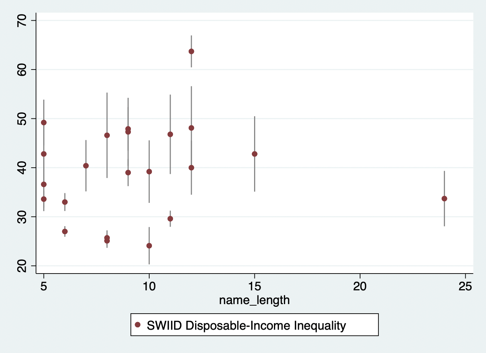

```{r setup, include=FALSE}
# Source: http://www.ssc.wisc.edu/~hemken/Stataworkshops/Stata%20and%20R%20Markdown/StataMarkdown.html and http://www.ssc.wisc.edu/~hemken/Stataworkshops/Stata%20and%20R%20Markdown/StataProfile.html
statapath <- "D:/Program Files (x86)/Stata14/StataMP-64.exe"
require(knitr)
knitr::opts_chunk$set(engine="stata", engine.path=statapath, comment="", echo = FALSE, message = FALSE, warning = FALSE)


# How the hook works: tells knitr to treat all subsequent chunks as Stata code, and sets some configuration options. This same code chunk is where I would define my collectcode (you could name it something else) chunk option. Include this in your document anywhere before your first Stata code chunk.
knitr::knit_hooks$set(saveForLater = function(before, options, envir) {
  if (!before) {
    profile <- file("profile.do", open="at")
    writeLines(options$code, profile)
    close(profile)
  }
})
```

The Standardized World Income Inequality Database (SWIID) uses a custom missing-data multiple-imputation algorithm to standardize observations collected from the [United Nations University's World Income Inequality Database version 2.0c](http://www.wider.unu.edu/research/Database/), the [OECD Income Distribution Database](http://www.oecd.org/social/inequality.htm), the [Socio-Economic Database for Latin America and the Caribbean generated by CEDLAS and the World Bank](http://sedlac.econo.unlp.edu.ar/eng/), the [Eurostat](http://epp.eurostat.ec.europa.eu), the [World Bank's PovcalNet](http://iresearch.worldbank.org/PovcalNet/index.htm), the [UN Economic Commission for Latin America and the Caribbean](http://interwp.cepal.org/sisgen/ConsultaIntegrada.asp?idIndicador=250\&idioma=e), national statistical offices around the world, and many other sources.  [Luxembourg Income Study](http://www.lisdatacenter.org) data serves as the standard.  


As described in @Solt2016, the SWIID maximizes the comparability of available income inequality data for the broadest possible sample of countries and years.  But incomparability remains, and it is sometimes substantial.  This remaining incomparability is reflected in the standard errors of the SWIID estimates, making it absolutely crucial to take this uncertainty into account when making comparisons across countries or over time [@Solt2009, p.238; @Solt2016, p.14].  Using older versions of the SWIID, however, incorporating the standard errors into an analysis required considerable effort.  It is now straightforward.

Beginning with version 5.0 of the SWIID, the inequality estimates and their associated uncertainty are represented by 100 separate imputations of the complete series: for any given observation, the differences across these imputations capture the uncertainty in the estimate.  The `SWIIDv5_1.zip` includes the file `SWIIDv5_1.dta`, which is pre-formatted to facilitate taking this uncertainty into account.  The following sections describe how to subset the data, merge in additional variables, and do analyses.

# Getting Started

The `SWIIDv5_1.dta` file is pre-formatted for use with Stata's tools for analyzing multiply imputed data. Estimates of each of four inequality measures and their associated uncertainty are represented by a placeholder variable (which has the measure's name but only missing data for all observations) plus 100 separate variables (prefixed with `_1_`, `_2_`, etc.): for any given observation, the differences across these 100 variables capture the uncertainty in the estimate.   

The four measures are:  

* `gini_net`: Estimate of Gini index of inequality in equivalized (square root scale) household disposable (post-tax, post-transfer) income, using [Luxembourg Income Study](http://www.lisdatacenter.org) data as the standard. 
* `gini_market`: Estimate of Gini index of inequality in equivalized (square root scale) household market (pre-tax, pre-transfer) income, using [Luxembourg Income Study](http://www.lisdatacenter.org) data as the standard. 
* `abs_red`: Estimated absolute redistribution, the number of Gini-index points market-income inequality is reduced due to taxes and transfers: the difference between the `gini_market` and `gini_net`. 
* `rel_red`: Estimated relative redistribution, the percentage reduction in market-income inequality due to taxes and transfers: the difference between the `gini_market` and `gini_net`, divided by `gini_market`, multiplied by 100.


This format facilitates taking the uncertainty in its estimates into account when conducting analyses, as will be discussed below.  It does not, however, lend itself easily to tasks such plotting.  The mean-plus-standard-error summary format is much better suited to such purposes.  The following code demonstrates how to put the SWIID in this summary format, as well as how to make a scatterplot with confidence intervals.

```{r}
use SWIIDv5_1.dta, clear
// Summarize the dataset
keep country year _*

foreach v in gini_net gini_market rel_red abs_red {
    egen `v' = rowmean(_*`v')
    egen `v'_se = rowsd(_*`v')
    gen `v'_95ub = `v' + 1.96*`v'_se
    gen `v'_95lb = `v' - 1.96*`v'_se
}
drop _*
sort country year

// A silly example
gen name_length = length(country)
gen first_letter = substr(country, 1, 1)
keep if year==2010 & first_letter=="S" /*2010 for Senegal, Serbia, . . .*/

// A scatterplot with 95% confidence intervals
twoway rspike gini_net_95ub gini_net_95lb name_length, lstyle(ci) || ///
    scatter gini_net name_length, msize(small) ///
    legend(order(2 "SWIID Net-Income Inequality")) 

graph export stata_scatter.png, replace //export the plot into a png file
```

```{r scatter-plot, engine='R'}

```


# Adding Variables
Generating new variables from the SWIID estimates requires a bit of care.  To preserve Stata's recognition of how the SWIID is formatted for analysis, the `mi passive:` prefix must be used.  Suppose we wanted to generate a variable for the log of `gini_net`.  For this new variable to take into account the uncertainty in the SWIID estimates, instead of simply typing `gen ln_gini_net = ln(gini_net)`, we need to preface that command with the `mi passive:` prefix, as below:

```{r eval=FALSE, echo = TRUE}
mi passive: gen ln_gini_net = ln(gini_net)
```

The result is a placeholder variable for the new measure `ln(gini_net)`, plus 100 separate variables prefixed with `_1_`, `_2_`, etc. that together represent the uncertainty in our new measure.  Note that there is no need to use `mi passive:` to create variables in the dataset that are not based on the SWIID estimates.

# Merging 

To merge the SWIID and additional data, simply merge the other dataset *into* the SWIID dataset.  Note that this means that the SWIID should be the 'master' file in the merge, the other data should be the 'using' file. 

Suppose we wanted to do a (simplified) replication of Solt, Habel, and Grant's  analysis [-@Solt2011] of [World Values Survey](http://worldvaluessurvey.org) data on religiosity.  As our measure of religiosity, we will use the WVS item on respondents' self-report of the importance of God to their lives, which is measured on a ten-point scale.  Given secularization theory, we will need to control for GDP per capita, which we will calculate from information from the [Penn World Tables](http://www.ggdc.net/pwt) [@Feenstra2015].  Below we first load the PWT dataset and use it to generate a dataset of GDP per capita (in thousands of dollars).  Then we load the WVS data, generate our variables of interest, and merge in our PWT data.  Finally, we merge these data into the SWIID.

```{r eval = FALSE, echo = TRUE}
// Get GDP per capita data from the Penn World Tables, Version 9.0 (Feenstra et al. 2015)
// download from http://www.rug.nl/research/ggdc/data/pwt/v90/pwt90.xlsx
// create gdppc and save as .dta

import excel using pwt90.xlsx, sheet("Data") firstrow clear
gen gdppc = rgdpe/pop/1000
drop if gdppc==.
keep country year gdppc
save pwt90_gdppc.dta, replace

// Get World Values Survey 6-wave data 
// from http://www.worldvaluessurvey.org/WVSDocumentationWVL.jsp
// generate variables of interest, merge in the PWT data, and save
use WVS_Longitudinal_1981_2014_stata_v2015_04_18.dta, clear
kountry S003, from(iso3n)
rename NAMES_STD country
gen year = S020
gen religiosity = F063 if F063>0
gen age = X003 if X003>0
gen educ = X025 if X025>0
gen male = (X001 == 1) if X001>0
keep country year religiosity male educ age

merge m:1 country year using pwt90_gdppc.dta
drop if _merge!=3
drop _merge
save wvs_pwt.dta, replace

// Now merge these data *into* the SWIID
use SWIIDv5_1.dta, clear
merge 1:m country year using wvs_pwt.dta
drop if _merge!=3
drop _merge
```

# Analyzing
Once any additional variables are created or merged in, we may proceed to analysis.  Continuing with our example, we estimate a three-level linear mixed-effects model of individual responses nested in country-years nested in countries using `mixed`.  To take the uncertainty in the SWIID estimates into account, we construct our model comman as usual, but precede it with the `mi estimate:` prefix to perform it on each of the 100 variables that report the uncertainty in the SWIID estimates. Note that performing an analysis 100 times can be time-consuming.

```{r eval = FALSE, echo = TRUE}
mi estimate: mixed religiosity gini_net gdppc age educ male || country: || country_year:
```

# Citing the SWIID
Please cite to the SWIID by referring to its article of record and including the version number and date of release:

> Solt, Frederick.  2016.  "The Standardized World Income Inequality Database."  *Social Science Quarterly* 97.  SWIID Version 5.1, July 2016.

```{r cleanup, engine='R'}
# Delete the profile.do used for storing the codes.
unlink("profile.do")
unlink(stringr::str_extract(list.files(), "stata.*\\.do"))
```